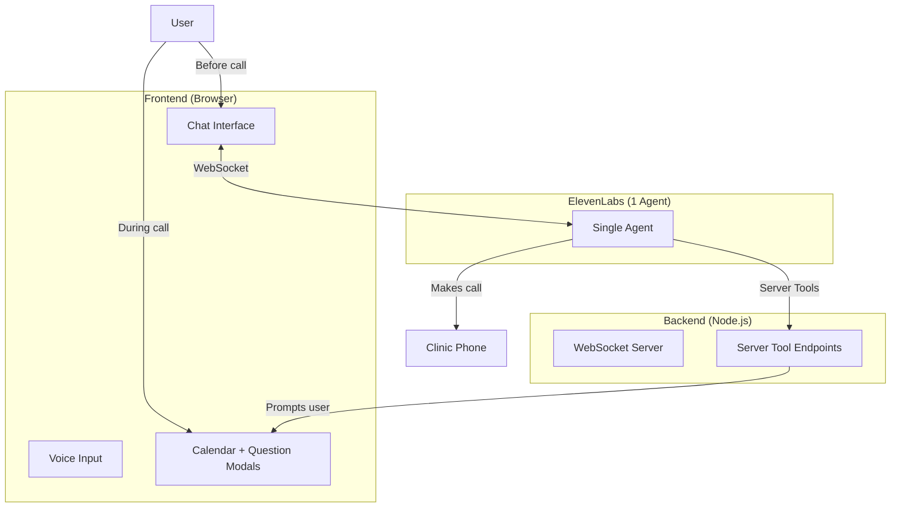

# ElevenLabs Single-Agent Healthcare System

A conversational AI system where **one ElevenLabs agent** handles both user chat AND phone calls to clinics.

## Architecture



---

## How It Works

| Phase | Connection | User Interaction |
|-------|------------|------------------|
| **Before call** | Agent ↔ Browser | Voice + Text chat |
| **During call** | Agent ↔ Phone | Text via modals (calendar, questions) |

---

## Server Tools (Configure in ElevenLabs Dashboard)

### 1. Get User Appointment Preference
```json
{
  "name": "get_user_appointment_preference",
  "description": "Ask patient to select appointment slot. Say 'give me a moment' then call this.",
  "webhook_url": "https://YOUR_URL/api/server-tools/get-preference",
  "parameters": {
    "type": "object",
    "properties": {
      "available_slots": {
        "type": "array",
        "items": { "type": "string" }
      }
    },
    "required": ["available_slots"]
  }
}
```

**Response:** `{ response_type: "slot_selected" | "ask_next_week", selected_slot: "..." }`

### 2. Ask User Question
```json
{
  "name": "ask_user_question",
  "description": "Ask patient a question during call. Say 'let me check with the patient' then call this.",
  "webhook_url": "https://YOUR_URL/api/server-tools/ask-user",
  "parameters": {
    "type": "object",
    "properties": {
      "question": { "type": "string" }
    },
    "required": ["question"]
  }
}
```

**Response:** `{ answer: "user's response" }`

---

## Client Tool (for triggering calls)

```json
{
  "name": "trigger_clinic_call",
  "description": "Start phone call to clinic when user agrees to schedule appointment"
}
```

In frontend, this calls `/api/trigger-call` which initiates the outbound call.

---

## Files

| File | Purpose |
|------|---------|
| [backend/server.js](backend/server.js) | Express server + WebSocket + server tool endpoints |
| [backend/.env.example](backend/.env.example) | Environment variables |
| [frontend/index.html](frontend/index.html) | UI with chat, calendar modal, question modal |
| [frontend/app.js](frontend/app.js) | ElevenLabs SDK + modal handling |
| [frontend/index.css](frontend/index.css) | Premium dark theme |

---

## Quick Start

```bash
# 1. Backend
cd backend
cp .env.example .env  # Add ELEVENLABS_API_KEY and ELEVENLABS_AGENT_ID
npm install
npm run dev

# 2. Expose for server tools (ngrok for local dev)
ngrok http 3001  # Use this URL in ElevenLabs dashboard

# 3. Frontend
open frontend/index.html
```

---

## Agent System Prompt

```
You are a friendly AI health assistant. Help users understand their symptoms.

CONVERSATION FLOW:
1. Greet user and ask about symptoms
2. Ask follow-up questions about duration, severity, location
3. If symptoms are critical, offer to call a clinic

CRITICAL SYMPTOMS (offer to call):
- Chest pain, difficulty breathing
- Severe headache with vision changes
- High fever (>103°F)

TOOLS:
- trigger_clinic_call: Use when user agrees to schedule appointment

DURING PHONE CALLS:
- You'll be connected to the clinic
- Use get_user_appointment_preference when given available times
- Use ask_user_question if receptionist asks something you don't know
- Always say "let me check with the patient" before using tools

You are NOT a doctor. Recommend professional care for concerning symptoms.
```
